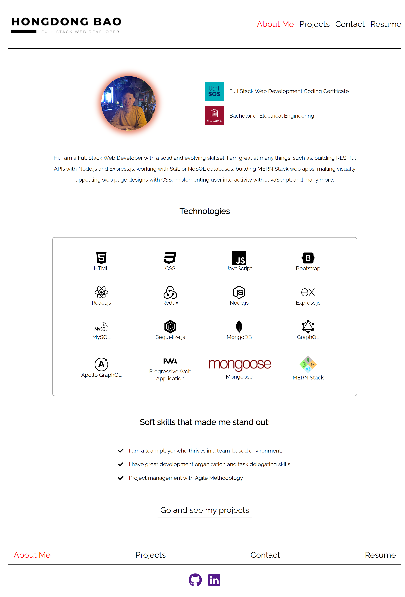
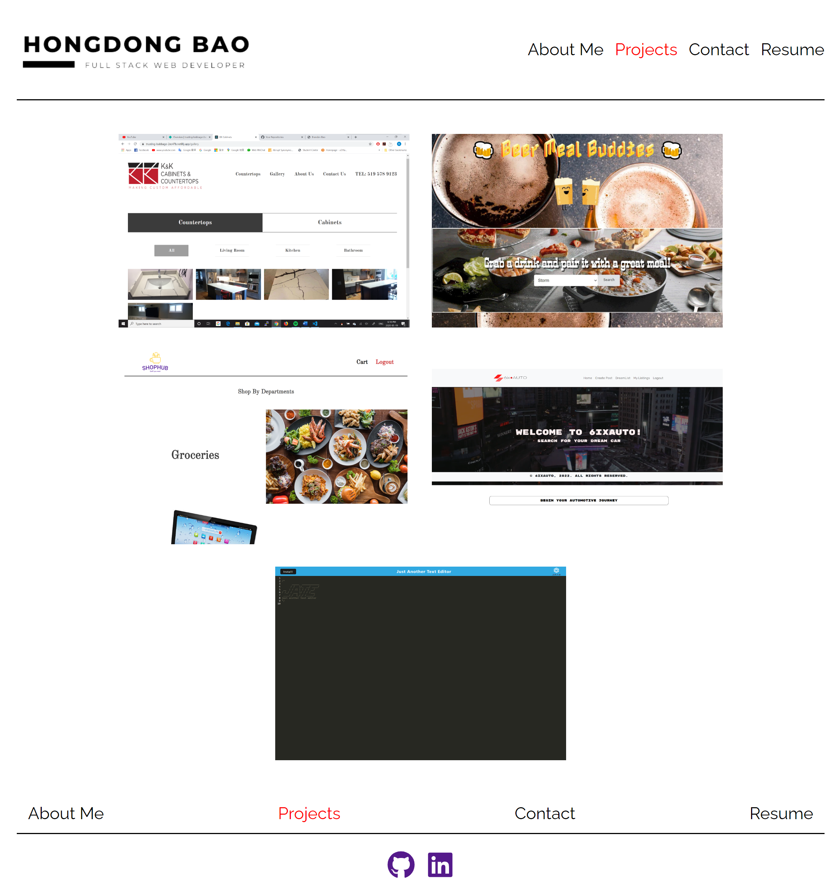
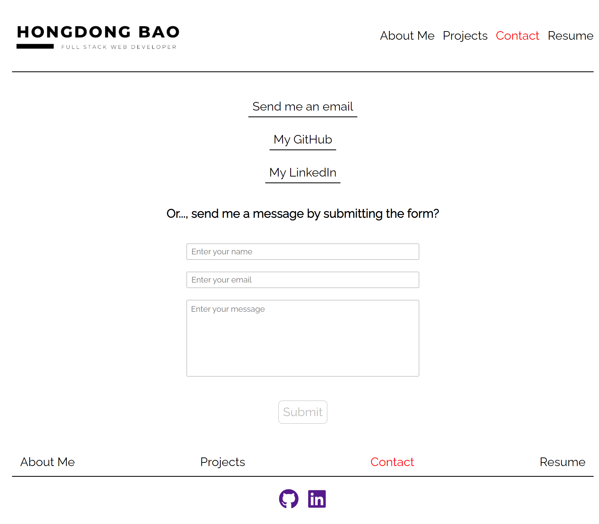
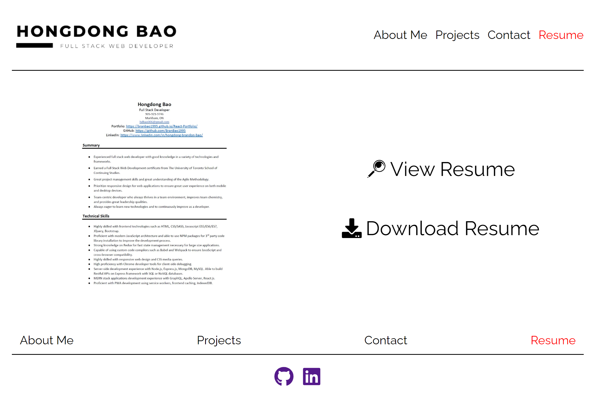

# Responsive Web Dev Portfolio with React.js

This is my developer portfolio built with React.js.

## Description

- This is my personal web developer's portflio built with React.js as a single page application
- In this portfolio you can find information about me, my projects and links, get in touch with me, and download my resume.
- This is a fully responsive web application and is mobile friendly.

## Table of content

- [Installation](#installation)
- [Usage](#usage)
- [Credits](#credits)
- [License](#license)

## Installation

- [Click here to go to my portfolio](https://branbao1995.github.io/React-Portfolio/)

## Usage

- Link to the Github Repository [https://github.com/BranBao1995/React-Portfolio](https://github.com/BranBao1995/React-Portfolio)

- This is the bio page of the portfolio:

  - 

- This is the projects page of the portfolio:

  - 

- This is the contact page of the portfolio:

  - 

- This is the resume page of the portfolio, click the "download resume" button to download my resume or click on the image itself to see full view of the resume:

  - 

## Credits

- Author's Github Profile: [https://github.com/BranBao1995](https://github.com/BranBao1995)

## License 

The MIT License

Copyright (c) [2022] [Hongdong Bao]

Permission is hereby granted, free of charge, to any person obtaining a copy
of this software and associated documentation files (the "Software"), to deal
in the Software without restriction, including without limitation the rights
to use, copy, modify, merge, publish, distribute, sublicense, and/or sell
copies of the Software, and to permit persons to whom the Software is
furnished to do so, subject to the following conditions:

The above copyright notice and this permission notice shall be included in all
copies or substantial portions of the Software.

THE SOFTWARE IS PROVIDED "AS IS", WITHOUT WARRANTY OF ANY KIND, EXPRESS OR
IMPLIED, INCLUDING BUT NOT LIMITED TO THE WARRANTIES OF MERCHANTABILITY,
FITNESS FOR A PARTICULAR PURPOSE AND NONINFRINGEMENT. IN NO EVENT SHALL THE
AUTHORS OR COPYRIGHT HOLDERS BE LIABLE FOR ANY CLAIM, DAMAGES OR OTHER
LIABILITY, WHETHER IN AN ACTION OF CONTRACT, TORT OR OTHERWISE, ARISING FROM,
OUT OF OR IN CONNECTION WITH THE SOFTWARE OR THE USE OR OTHER DEALINGS IN THE
SOFTWARE.
